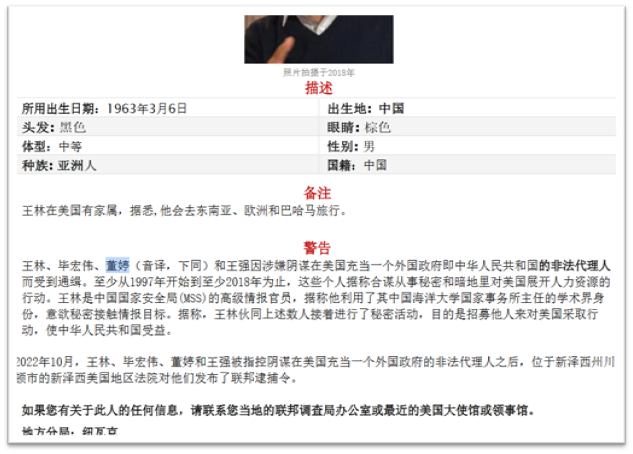

# OSINT Challenge — "The Pitfall"

## 🧭 Executive Summary
We captured one of them but we need a good answer to get the second one. The answer is the flag.

•	宏伟?
•	嗯
•	这是王林
•	非安全通道，少说信息
•	好
•	我们需要缺少那部分
•	周一9点，在奥斯陆Z地点
•	最后确认，谁在问?

## 🧰 Methodology
By translating the Chinese text, we can discern two names: Hóngwěi (宏伟) and Wáng lín (王林). By searching for the two names on Google we are led to an arrest warrant on the site of the Federal Bureau of Investigation regarding the latter individual. The warrant is in Chinese and when translating it we discover the name of another accomplice:  Dǒng tíng (董婷). The flag is the name of said accomplice in the Hanzi script: “董婷”. 

## 🧩 Lessons Learned
Cross-language OSINT often requires translation + authoritative source verification; preserve non-Latin scripts in reporting.

## 🖼️  Evidence

## 🧠 Tags
'#OSINT' '#GoogleSearch' '#CTF' '#Languages'

