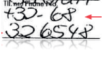

# OSINT Challenge — "Cherchez la Femme"

## 🧭 Executive Summary
I met this girl many years ago in Oslo. She told me she lived in a hotel and wrote down her phone number on a piece of paper. She didn’t even tell me her name and of course the phone number was fake. After all these years can you help me to find her name at least?

## 🧰 Methodology
A quick Google search of the phone number presented in the picture “68326548” presents us with articles containing the name of a woman who checked into a hotel using a fake name and was found dead 25 years ago. The flag is the name of the woman, “Jennifer Fairgate”.

## 🧩 Lessons Learned
Phone numbers appearing in images may correlate to news articles or public records; archive search is useful.

## 🖼️  Evidence

## 🧠 Tags
'#OSINT' '#GoogleSearch' '#CTF' '#JenniferFairgate'

